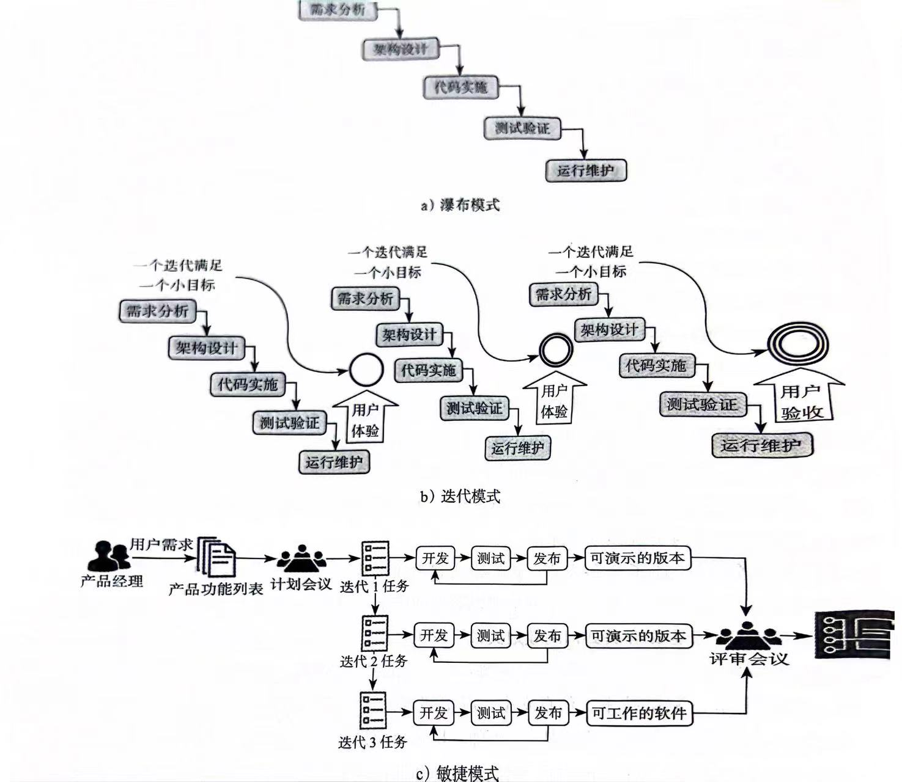
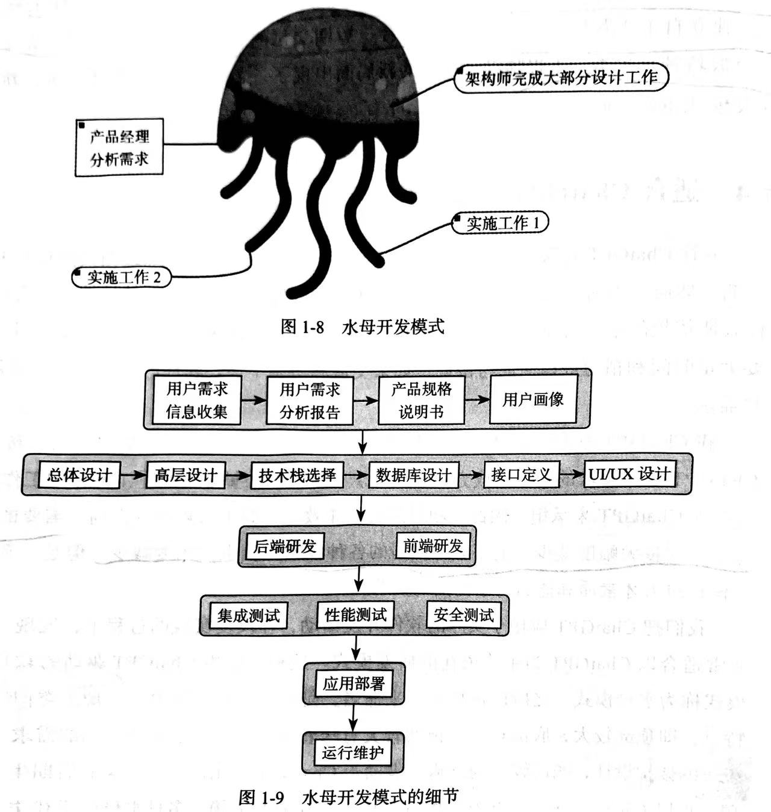

# 大模型对研发流程（SDLC）改造

## 软件开发生命周期（Software Development Life Cycle, SDLC）

软件开发生命周期（SDLC）是一个过程，它包括一系列的步骤，这些步骤在软件开发和维护过程中被遵循。以下是SDLC的主要阶段：

- **分析**：在这个阶段，开发团队将确定项目的需求和目标。这通常涉及到与客户或用户进行交流，以理解他们的需求和期望。

- **设计**：一旦需求被确定，设计阶段就开始了。在这个阶段，开发团队将创建一个详细的软件设计，包括系统架构和数据库设计。

- **编码**：在设计完成后，开发团队将开始编写代码。这个阶段通常是SDLC中最耗时的部分。

- **测试**：编码完成后，软件将进行测试，以确保它满足所有的需求，并且没有错误或缺陷。

- **部署**：一旦软件通过了所有的测试，它就可以被部署到生产环境中。在这个阶段，软件将被安装和配置在用户的设备上。

- **维护**：软件部署后，开发团队将进行持续的维护，以确保软件的稳定性和性能。这可能包括修复错误，添加新功能，或者更新软件以适应新的需求或技术。

SDLC 给软件开发提供了一个结构化的框架，其目的是帮助项目团队实现高质量的软件产品。在 ChatGPT 时代下的开发，也脱离不开 SDLC，但是我们会采用全新的开发模式。

## 开发模式的变革

在软件开发过程中，我们通常会采用以下几种开发模式：

- **瀑布模式**：瀑布模式是一种线性的开发方法，每个阶段依次进行，下一个阶段必须等待上一个阶段完成后才能开始。这种模式的优点是易于理解和管理，但缺点是缺乏灵活性，一旦需求发生变化，修改成本会非常高。

- **迭代模式**：迭代模式是一种非线性的开发方法，它将项目分解为多个小的迭代周期。每个迭代周期都包括需求分析、设计、编码和测试等阶段。这种模式的优点是可以快速适应需求变化，缺点是可能会导致项目的整体架构不稳定。

- **敏捷模式**：敏捷模式是一种强调团队协作、客户参与、响应变化和交付可用软件的开发方法。敏捷模式的优点是可以快速适应变化，提高客户满意度，缺点是需要高度的自我组织和自我管理能力。

上面三种模式，在各种场景中各有各的用处，我们此处并不单独分析上面模式使用的场景和优劣。我们会讨论，在有了 ChatGPT之后，工程师在工作上发生的变化：
- 以前需要多个工程师反复讨论、互动协调、旷日持久的研发活动
- 变成了极少数的工程师在ChatGPT的辅助下，独立自主或者与少数几个人相互配合、短期交付的新研发模式。
- 大兵军团模式作战编程少数特种兵作战

为了适应这种变化，新的开发模式也应用而生。

## 全新开发模式：水母开发模式

这种模式的特点是顶部大，底部较小。
- 顶部代表着开发过程中强调前期的需求分析和统一的架构设计
- 底部小的意味着借助ChatGPT输出的设计方案和后期生成的代码，可以大幅减少对开发、测试和运维工程师的依赖。
- 多只水母触手代表了在上层用户需求分析和总体架构设计的基础上，可以并行许多种不同模块的具体实施，比如代码调试、测试验证、应用部署和系统运维。

这种方式的好处就在于可以有效的避免信息在众多项目参与者之间传递时失真或丢失，从而使软件开发能够更好地满足用户需求，并且缩短开发周期。

下面是采用该种模式下，人员构成和比例的具体的情况。

## ChatGPT 对开发工程师的影响

| 维度 | 变化 |
| ---- | ---- |
|   定位   |   软件开发工程师从如何在意识中通过思考形成严谨的逻辑，变成如何把用户需求准确完整地向ChatGPT提出。这与从有人驾驶汽车发展为无人驾驶汽车异曲同工。在有人驾驶时代，人的定位既是司机也是乘客；在无人驾驶时代，人的定位就非常清晰地只剩下乘客。在有人驾驶时代，人的责任是操纵汽车、判断交通情况，以把汽车安全地驾驶到目的地；在无人驾驶时代，人的责任是清楚地指挥系统把汽车开到目的地。   |
|   技能   |   因为定位的变化，所以对工程师的技能要求也发生了变化。我们不再要求软件开发工程师在逻辑思考方面如何强大，而是聚焦在是否能够理解并掌握用户需求，根据软件开发生命周期，把用户需求逐步分解成合适的问题，从ChatGPT那里获得答案。计算器就是一个好例子，在计算器出现以前，计算是通过大脑完成的；在计算器出现以后，计算是通过按动计算器的键盘完成的。计算器的使用者聚焦要计算什么而不再是如何进行计算，这是本质性的变化。   |
|    素质     |    ChatGPT驱动下的软件开发过程更加强调软件开发工程师要具备可以理解用户需求的同理心，对用户需求更敏感、更体贴，更善于与用户沟通以及向ChatGPT转译和表达用户需求。对研发工程师的素质要求从强调逻辑思维转变为强调形象思维。曾几何时，裁缝是个不可或缺的职业。在那个时代，强调的是裁缝要手巧，可以穿针引线，把衣服做得服服帖帖、严丝合缝。而今天的时装行业，强调的是心灵，要求能敏感地捕捉市场脉搏和流行趋势，掌握消费者的需求并设计出符合时代潮流的服装。从强调手巧演化为聚焦心灵，行业的名字也从裁缝转变为时装。    |
|   数量   |   在以人脑思考为主产生逻辑流（程序）的今天，需要大量的工程师参与到软件开发的各个环节。而在ChatGPT驱动下的软件开发过程中，需要的是少量从事用户需求分析和架构设计的软件开发工程师。类似的工作岗位变迁在历史上也曾发生过很多次。20世纪50年代和60年代曾经是电话接线员职业发展的高峰期，美国大约有超过35万名电话接线员。这些接线员被用于连接电话线路、传递呼叫信息和为电话用户提供支持。自动交换机的出现彻底改变了这个行业。   |

虽然ChatGPT会给软件开发工程师带来巨大的改变，但是并不是说要替代掉这个行业，知识对不同的从业人员，提出了新的要求。
| 角色 | 新要求 |
| ---- | ---- |
| 产品经理 | 尽管在分析用户需求的过程中可以借助ChatGPT，但是最终的判断和决策仍然需要产品经理根据实际情况和经验来完成。 |
| 架构师 | 尽管可以利用ChatGPT来获取设计相关的技术建议甚至生成设计方案，然而，架构师仍然需要根据项目需求和团队现实进行判断和调整。 |
| UI／UX设计师 | 尽管可以借助ChatGPT或者其他的人工智能图片生成工具完成页面的风格设计，但是，只有UI／UX设计师才能通过视觉感受判断风格是否符合用户需求。 |
| 程序员 | 尽管可以借助ChatGPT来获得编程建议、问题解答和代码示例，但是，ChatGPT所生成的代码可能仍然需要程序员进行调整和优化。 |
| 测试人员 | 尽管可以利用ChatGPT来编写测试大纲、测试用例和测试脚本，但是，仍然需要测试人员根据项目特点和需求进行调整和完善。 |

来接了 ChatGPT 对软件工程师带来的巨大变化，接下来我们就需要去了解与ChatGPT的沟通技巧。