# 提示技术

时至今日，改进提示显然有助于在不同任务上获得更好的结果。这就是提示工程背后的整个理念。

尽管基础示例很有趣，但在本节中，我们将介绍更高级的提示工程技术，使我们能够完成更复杂和有趣的任务。

## 零样本提示
如今，经过大量数据训练并调整指令的LLM能够执行零样本任务。我们在前一节中尝试了一些零样本示例。以下是我们使用的一个示例：

*提示：*
```
将文本分类为中性、负面或正面。

文本：我认为这次假期还可以。
情感：
```

*输出：*
```
中性
```

请注意，在上面的提示中，我们没有向模型提供任何示例——这就是零样本能力的作用。

指令调整已被证明可以改善零样本学习[Wei等人（2022）](https://arxiv.org/pdf/2109.01652.pdf)。指令调整本质上是在通过指令描述的数据集上微调模型的概念。此外，[RLHF](https://arxiv.org/abs/1706.03741)（来自人类反馈的强化学习）已被采用以扩展指令调整，其中模型被调整以更好地适应人类偏好。这一最新发展推动了像ChatGPT这样的模型。我们将在接下来的章节中讨论所有这些方法和方法。

当零样本不起作用时，建议在提示中提供演示或示例，这就引出了少样本提示。在下一节中，我们将演示少样本提示。

## 少样本提示

虽然大型语言模型展示了惊人的零样本能力，但在使用零样本设置时，它们在更复杂的任务上仍然表现不佳。少样本提示可以作为一种技术，以启用上下文学习，我们在提示中提供演示以引导模型实现更好的性能。演示作为后续示例的条件，我们希望模型生成响应。

让我们通过[Brown等人2020年](https://arxiv.org/abs/2005.14165)提出的一个例子来演示少样本提示。在这个例子中，任务是在句子中正确使用一个新词。

*提示：*
```
“whatpu”是坦桑尼亚的一种小型毛茸茸的动物。一个使用whatpu这个词的句子的例子是：
我们在非洲旅行时看到了这些非常可爱的whatpus。
“farduddle”是指快速跳上跳下。一个使用farduddle这个词的句子的例子是：
```

*输出：*
```
当我们赢得比赛时，我们都开始庆祝跳跃。
```

我们可以观察到，模型通过提供一个示例（即1-shot）已经学会了如何执行任务。对于更困难的任务，我们可以尝试增加演示（例如3-shot、5-shot、10-shot等）。

根据[Min等人（2022）](https://arxiv.org/abs/2202.12837)的研究结果，以下是在进行少样本学习时关于演示/范例的一些额外提示：

- “标签空间和演示指定的输入文本的分布都很重要（无论标签是否对单个输入正确）”
- 使用的格式也对性能起着关键作用，即使只是使用随机标签，这也比没有标签好得多。
- 其他结果表明，从真实标签分布（而不是均匀分布）中选择随机标签也有帮助。

让我们尝试一些例子。让我们首先尝试一个随机标签的例子（意味着将标签Negative和Positive随机分配给输入）：

*提示：*
```
这太棒了！// Negative
这太糟糕了！// Positive
哇，那部电影太棒了！// Positive
多么可怕的节目！//
```

*输出：*
```
Negative
```

即使标签已经随机化，我们仍然得到了正确的答案。请注意，我们还保留了格式，这也有助于。实际上，通过进一步的实验，我们发现我们正在尝试的新GPT模型甚至对随机格式也变得更加稳健。例如：

*提示：*
```
Positive This is awesome! 
This is bad! Negative
Wow that movie was rad!
Positive
What a horrible show! --
```

*输出：*
```
Negative
```

上面的格式不一致，但模型仍然预测了正确的标签。我们必须进行更彻底的分析，以确认这是否适用于不同和更复杂的任务，包括提示的不同变体。

### 少样本提示的限制

标准的少样本提示对许多任务都有效，但仍然不是一种完美的技术，特别是在处理更复杂的推理任务时。让我们演示为什么会这样。您是否还记得之前提供的任务：

```
这组数字中的奇数加起来是一个偶数：15、32、5、13、82、7、1。

A：
```

如果我们再试一次，模型输出如下：

```
是的，这组数字中的奇数加起来是107，是一个偶数。
```

这不是正确的答案，这不仅突显了这些系统的局限性，而且需要更高级的提示工程。

让我们尝试添加一些示例，看看少样本提示是否可以改善结果。

*提示：*
```
这组数字中的奇数加起来是一个偶数：4、8、9、15、12、2、1。
A：答案是False。

这组数字中的奇数加起来是一个偶数：17、10、19、4、8、12、24。
A：答案是True。

这组数字中的奇数加起来是一个偶数：16、11、14、4、8、13、24。
A：答案是True。

这组数字中的奇数加起来是一个偶数：17、9、10、12、13、4、2。
A：答案是False。

这组数字中的奇数加起来是一个偶数：15、32、5、13、82、7、1。
A：
```

*输出：*
```
答案是True。
```

这没用。似乎少样本提示不足以获得这种类型的推理问题的可靠响应。上面的示例提供了任务的基本信息。如果您仔细观察，我们引入的任务类型涉及几个更多的推理步骤。换句话说，如果我们将问题分解成步骤并向模型演示，这可能会有所帮助。最近，[思维链（CoT）提示](https://arxiv.org/abs/2201.11903)已经流行起来，以解决更复杂的算术、常识和符号推理任务。

总的来说，提供示例对解决某些任务很有用。当零样本提示和少样本提示不足时，这可能意味着模型学到的东西不足以在任务上表现良好。从这里开始，建议开始考虑微调您的模型或尝试更高级的提示技术。接下来，我们将讨论一种流行的提示技术，称为思维链提示，它已经获得了很多关注。


## Chain-of-Thought Prompting

### 链式思考（CoT）提示

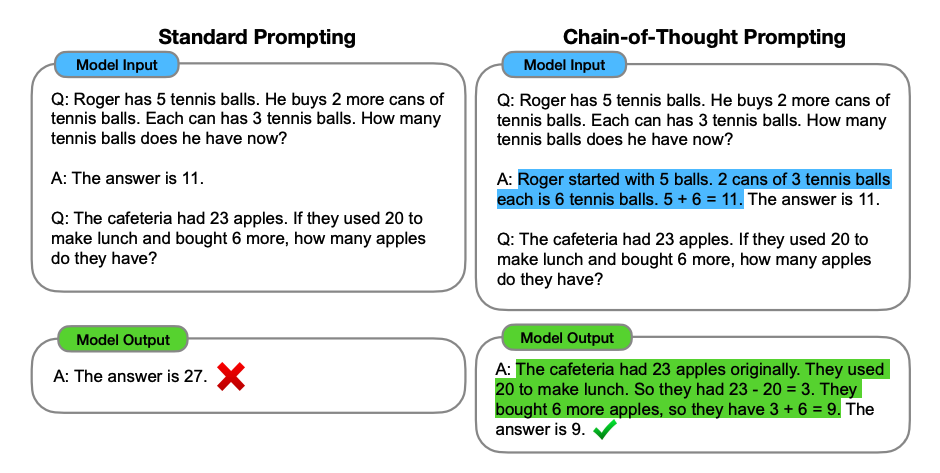

图片来源：[Wei等人（2022）](https://arxiv.org/abs/2201.11903)

在[Wei等人（2022）](https://arxiv.org/abs/2201.11903)中引入的链式思考（CoT）提示通过中间推理步骤实现了复杂的推理能力。您可以将其与少样本提示相结合，以获得更好的结果，以便在回答之前进行推理的更复杂的任务。

*提示：*
```
这组数中的奇数加起来是偶数：4、8、9、15、12、2、1。
A：将所有奇数相加（9、15、1）得到25。答案为False。

这组数中的奇数加起来是偶数：17、10、19、4、8、12、24。
A：将所有奇数相加（17、19）得到36。答案为True。

这组数中的奇数加起来是偶数：16、11、14、4、8、13、24。
A：将所有奇数相加（11、13）得到24。答案为True。

这组数中的奇数加起来是偶数：17、9、10、12、13、4、2。
A：将所有奇数相加（17、9、13）得到39。答案为False。

这组数中的奇数加起来是偶数：15、32、5、13、82、7、1。
A：
```

*输出：*
```
将所有奇数相加（15、5、13、7、1）得到41。答案为False。
```

哇！我们可以看到在提供推理步骤时得到了完美的结果。实际上，我们可以通过提供更少的示例来解决此任务，即仅一个示例似乎就足够了：

*提示：*
```
这组数中的奇数加起来是偶数：4、8、9、15、12、2、1。
A：将所有奇数相加（9、15、1）得到25。答案为False。

这组数中的奇数加起来是偶数：15、32、5、13、82、7、1。
A：
```

*输出：*
```
将所有奇数相加（15、5、13、7、1）得到41。答案为False。
```

请记住，作者声称这是足够大的语言模型才会出现的新兴能力。

### 零样本COT提示

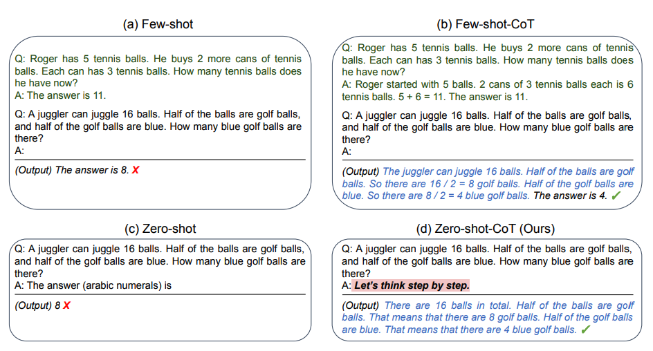


图片来源：[Kojima等人（2022）](https://arxiv.org/abs/2205.11916)

最近提出的一个新想法是[零样本CoT](https://arxiv.org/abs/2205.11916)（Kojima等人，2022年），它基本上涉及将“让我们逐步思考”添加到原始提示中。让我们尝试一个简单的问题，看看模型的表现如何：

*提示：*
```
我去市场买了10个苹果。我给了邻居2个苹果和修理工2个苹果。然后我去买了5个苹果并吃了1个。我还剩下多少苹果？
```

*输出：*
```
11个苹果
```

答案是不正确的！现在让我们尝试使用特殊提示。

*提示：*
```
我去市场买了10个苹果。我给了邻居2个苹果和修理工2个苹果。然后我去买了5个苹果并吃了1个。我还剩下多少苹果？

让我们逐步思考。
```

*输出：*
```
首先，您从10个苹果开始。
您给了邻居和修理工各2个苹果，所以您还剩下6个苹果。
然后您买了5个苹果，所以现在您有11个苹果。
最后，您吃了1个苹果，所以您还剩下10个苹果。
```

令人印象深刻的是，这个简单的提示在这个任务中非常有效。这在您没有太多示例可用于提示时特别有用。

## 自我一致性

也许在提示工程中更高级的技术之一是自我一致性。由[Wang等人（2022）](https://arxiv.org/pdf/2203.11171.pdf)提出，自我一致性旨在“替换链式思维提示中使用的天真贪婪解码方法”。其想法是通过少样本CoT采样多个不同的推理路径，并使用生成结果选择最一致的答案。这有助于提高CoT提示在涉及算术和常识推理的任务中的性能。

让我们尝试以下算术推理示例：

*提示：*
```
当我6岁时，我的妹妹是我的一半年龄。现在我70岁了，我的妹妹多大？
```

*输出：*
```
35
```

输出是错误的！我们如何通过自我一致性来改进这个问题？让我们试试。我们将使用Wang等人2022年的少量样本范例（表17）：

*提示：*
```
Q：林中有15棵树。林业工人今天将在林中种树。完成后，将有21棵树。林业工人今天种了多少棵树？
A：我们从15棵树开始。后来我们有21棵树。差异必须是他们种树的数量。因此，他们必须种了21-15 = 6棵树。答案是6。

Q：停车场有3辆汽车，又来了2辆汽车，停车场有多少辆汽车？
A：停车场已经有3辆汽车。又来了2辆。现在有3 + 2 = 5辆汽车。答案是5。

Q：Leah有32块巧克力，她的姐姐有42块。如果他们吃了35块，他们总共还剩多少块？
A：Leah有32块巧克力，Leah的姐姐有42块。这意味着最初有32 + 42 = 74块巧克力。已经吃了35块。因此，他们总共还剩74-35 = 39块巧克力。答案是39。

Q：Jason有20个棒棒糖。他给Denny一些棒棒糖。现在Jason只有12个棒棒糖。Jason给Denny多少棒棒糖？
A：Jason有20个棒棒糖。因为他现在只有12个，所以他必须把剩下的给Denny。他给Denny的棒棒糖数量必须是20-12 = 8个棒棒糖。答案是8。

Q：Shawn有五个玩具。圣诞节，他从他的父母那里得到了两个玩具。他现在有多少个玩具？
A：他有5个玩具。他从妈妈那里得到了2个，所以在那之后他有5 + 2 = 7个玩具。然后他从爸爸那里得到了2个，所以总共他有7 + 2 = 9个玩具。答案是9。

Q：服务器房间里有9台计算机。从周一到周四，每天都会安装5台计算机。现在服务器房间里有多少台计算机？
A：从周一到周四有4天。每天都添加了5台计算机。这意味着总共添加了4 * 5 =
20台计算机。一开始有9台计算机，所以现在有9 + 20 = 29台计算机。答案是29。

Q：Michael有58个高尔夫球。星期二，他丢失了23个高尔夫球。星期三，他又丢失了2个。星期三结束时他还剩多少个高尔夫球？
A：Michael最初有58个球。星期二他丢失了23个，所以在那之后他有58-23 = 35个球。星期三他又丢失了2个，所以现在他有35-2 = 33个球。答案是33。

Q：Olivia有23美元。她用每个3美元的价格买了五个百吉饼。她还剩多少钱？
A：她用每个3美元的价格买了5个百吉饼。这意味着她花了15美元。她还剩8美元。

Q：当我6岁时，我的妹妹是我的一半年龄。现在我70岁了，我的妹妹多大？
A：
```

*输出1：*
```
当我6岁时，我的妹妹是我的一半年龄，也就是3岁。现在我70岁了，所以她是70-3 = 67岁。答案是67。
```

*输出2：*
```
当叙述者6岁时，他的妹妹是他年龄的一半，也就是3岁。现在叙述者70岁了，他的妹妹应该是70-3 = 67岁。答案是67。
```

*输出3：*
```
当我6岁时，我的妹妹是我的一半年龄，也就是3岁。现在我70岁了，所以她是70/2 = 35岁。答案是35。
```

计算最终答案涉及几个步骤（详见论文），但为了简单起见，我们可以看到已经出现了大多数答案，因此这基本上将成为最终答案。


## 生成知识提示

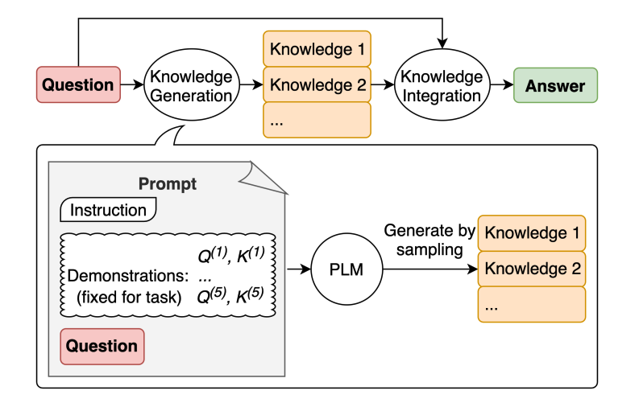


图片来源：[Liu等人2022](https://arxiv.org/pdf/2110.08387.pdf)

LLM继续得到改进，其中一种流行的技术是能够融合知识或信息，以帮助模型做出更准确的预测。

使用类似的思路，模型是否也可以在做出预测之前用于生成知识呢？这就是[Liu等人2022](https://arxiv.org/pdf/2110.08387.pdf)的论文所尝试的——生成知识以作为提示的一部分。特别是，这对于常识推理等任务有多大帮助？

让我们尝试一个简单的提示：

*提示：*
```
高尔夫球的一部分是试图获得比其他人更高的得分。是或否？
```

*输出：*
```
是。
```

这种错误揭示了LLM在执行需要更多关于世界的知识的任务时的局限性。我们如何通过生成知识来改进呢？

首先，我们生成一些“知识”：

*提示：*
```
输入：希腊比墨西哥大。
知识：希腊的面积约为131,957平方公里，而墨西哥的面积约为1,964,375平方公里，使墨西哥比希腊大了1,389%。

输入：眼镜总是会起雾。
知识：当你的汗水、呼吸和周围的湿度中的水蒸气落在冷的表面上，冷却并变成微小的液滴时，会在眼镜镜片上产生冷凝。你看到的是一层薄膜。你的镜片相对于你的呼吸会比较凉，尤其是当外面的空气很冷时。

输入：鱼有思考能力。
知识：鱼比它们看起来更聪明。在许多领域，如记忆力，它们的认知能力与或超过非人类灵长类动物等“更高级”的脊椎动物。鱼的长期记忆帮助它们跟踪复杂的社交关系。

输入：一个人一生中吸烟很多香烟的常见影响是患肺癌的几率高于正常水平。
知识：那些一生中平均每天吸烟不到一支香烟的人，患肺癌的风险是从不吸烟者的9倍。在每天吸烟1到10支香烟之间的人群中，死于肺癌的风险几乎是从不吸烟者的12倍。

输入：一块石头和一颗卵石大小相同。
知识：卵石是一种根据Udden-Wentworth沉积学尺度的颗粒大小为4到64毫米的岩屑。卵石通常被认为比颗粒（直径2到4毫米）大，比卵石（直径64到256毫米）小。

输入：高尔夫球的一部分是试图获得比其他人更高的得分。
知识：
```

*知识1：*
```
高尔夫球的目标是以最少的杆数打完一组洞。一轮高尔夫球比赛通常包括18个洞。每个洞在标准高尔夫球场上一轮只打一次。每个杆计为一分，总杆数用于确定比赛的获胜者。
```

*知识2：*
```
高尔夫球是一项精密的球杆运动，竞争选手（或高尔夫球手）使用许多类型的球杆，用最少的杆数将球打入球场上一系列洞中。目标是以最低的分数完成比赛，该分数是通过将每个洞上所用的杆数相加计算出来的。得分最低的选手赢得比赛。
```

我们使用[Liu等人2022](https://arxiv.org/pdf/2110.08387.pdf)的论文中提供的提示。

下一步是将知识整合并得出预测。我将问题重新格式化为QA格式，以指导答案格式。

*提示：*
```
问题：高尔夫球的一部分是试图获得比其他人更高的得分。是或否？

知识：高尔夫球的目标是以最少的杆数打完一组洞。一轮高尔夫球比赛通常包括18个洞。每个洞在标准高尔夫球场上一轮只打一次。每个杆计为一分，总杆数用于确定比赛的获胜者。

解释和答案： 
```

*答案1（置信度非常高）：*
```
不是，高尔夫球的目标不是获得比其他人更高的得分。相反，目标是以最少的杆数打完一组洞。总杆数用于确定比赛的获胜者，而不是总得分。
```

```
问题：高尔夫球的一部分是试图获得比其他人更高的得分。是或否？

知识：高尔夫球是一项精密的球杆运动，竞争选手（或高尔夫球手）使用许多类型的球杆，用最少的杆数将球打入球场上一系列洞中。目标是以最低的分数完成比赛，该分数是通过将每个洞上所用的杆数相加计算出来的。得分最低的选手赢得比赛。

解释和答案：
```

*答案2（置信度要低得多）：*
```
是的，高尔夫球的一部分是试图获得比其他人更高的得分。每个选手都试图以最少的杆数打完一组洞。总杆数用于确定比赛的获胜者，而不是总得分。得分最低的选手赢得比赛。
```

这个例子发生了一些非常有趣的事情。在第一个答案中，模型非常自信，但在第二个答案中不太自信。我简化了过程以进行演示，但在得出最终答案时还有一些细节需要考虑。请查看论文以了解更多。


## 链式提示

### 简介

为了提高大语言模型的性能使其更可靠，一个重要的提示工程技术是将任务分解为许多子任务。 确定子任务后，将子任务的提示词提供给语言模型，得到的结果作为新的提示词的一部分。 这就是所谓的链式提示（prompt chaining），一个任务被分解为多个子任务，根据子任务创建一系列提示操作。

链式提示可以完成很复杂的任务。LLM可能无法仅用一个非常详细的提示完成这些任务。在链式提示中，提示链对生成的回应执行转换或其他处理，直到达到期望结果。

除了提高性能，链式提示还有助于提高LLM应用的透明度，增加控制性和可靠性。这意味着您可以更容易地定位模型中的问题，分析并改进需要提高的不同阶段的性能。

链式提示在构建LLM驱动的对话助手和提高应用程序的个性化用户体验方面非常有用。

### 链式提示使用示例

### 文档问答中的链式提示

提示链可以用于不同的场景，这些场景可能涉及多个操作或转换。例如，LLM的一个常见用途是根据大型文本文档回答问题。想要更好阅读大文本文档，可以设计两个不同的提示，第一个提示负责提取相关引文以回答问题，第二个提示则以引文和原始文档为输入来回答给定的问题。换句话说，可以创建两个不同的提示来执行根据文档回答问题的任务。

下面的第一个提示根据问题从文档中提取相关引文。请注意，为了简化，我们为文档添加了一个占位符`{{文档}}`。要测试此提示，您可以从维基百科复制并粘贴一篇文章，例如这个关于[提示工程](https://zh.wikipedia.org/wiki/提示工程)的页面。由于此任务使用了较长的上下文，我们使用了OpenAI的`gpt-4-1106-preview`模型。您也可以将此提示与其他长上下文LLM（如Claude）一起使用。

提示1:
```
你是一个很有帮助的助手。你的任务是根据文档回答问题。第一步是从文档中提取与问题相关的引文，由####分隔。请使用<quotes></quotes>输出引文列表。如果没有找到相关引文，请回应“未找到相关引文！”。

####
{{文档}}
####
```

这是整个提示的截图，包括通过`user`角色传递的问题。

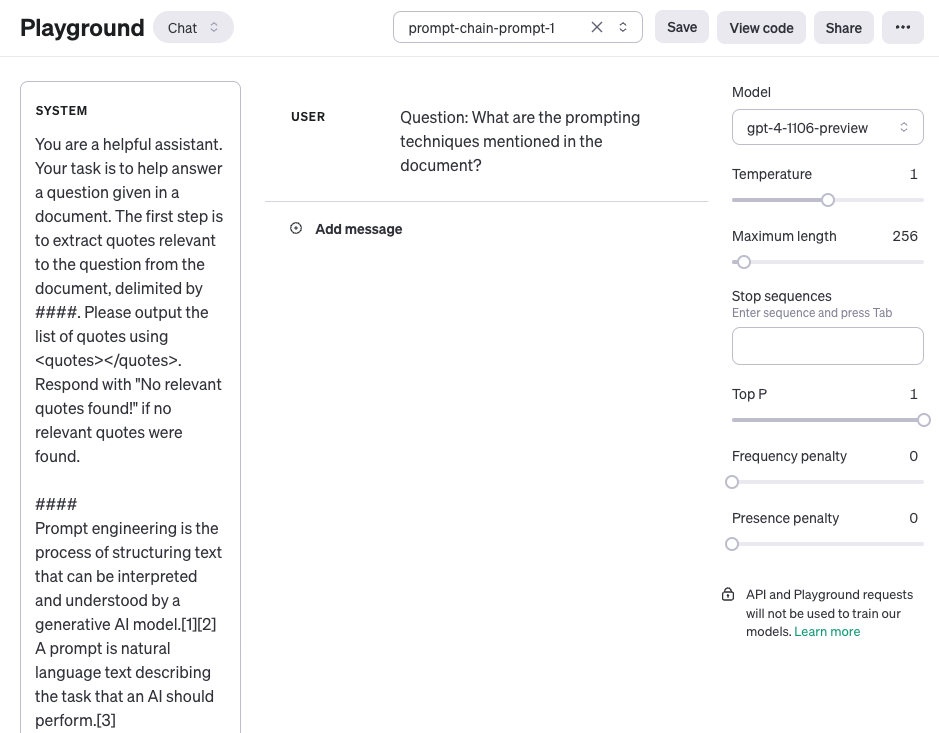

提示1的输出：
```
<quotes>
- Chain-of-thought (CoT) prompting[27]
- Generated knowledge prompting[37]
- Least-to-most prompting[38]
- Self-consistency decoding[39]
- Complexity-based prompting[41]
- Self-refine[42]
- Tree-of-thought prompting[43]
- Maieutic prompting[45]
- Directional-stimulus prompting[46]
- Textual inversion and embeddings[59]
- Using gradient descent to search for prompts[61][62][63][64]
- Prompt injection[65][66][67]
</quotes>
```

在第一个提示中返回的引文现在可以用作下面第二个提示的输入。您可以对这些引文进行清理，比如移除引用标志。可以在提示链中新建另一个提示来移除或使用这些引用标志，但现在您可以忽略这些。然后，第二个提示接收由第一个提示提取的相关引文，并根据文档和这些提取的引文生成一个有帮助的回答。第二个提示可以是以下内容：

提示2：
```
根据从文档中提取的相关引文（由<quotes></quotes>分隔）和原始文档（由####分隔），请构建对问题的回答。请确保答案准确、语气友好且有帮助。

####
{{文档}}
####

<quotes>
- Chain-of-thought (CoT) prompting[27]
- Generated knowledge prompting[37]
- Least-to-most prompting[38]
- Self-consistency decoding[39]
- Complexity-based prompting[41]
- Self-refine[42]
- Tree-of-thought prompting[43]
- Maieutic prompting[45]
- Directional-stimulus prompting[46]
- Textual inversion and embeddings[59]
- Using gradient descent to search for prompts[61][62][63][64]
- Prompt injection[65][66][67]
</quotes>
```

提示2的输出：
```
文档中提到的提示技术包括：

1. Chain-of-thought (CoT) prompting[27]
2. Generated knowledge prompting[37]
3. Least-to-most prompting[38]
4. Self-consistency decoding[39]
5. Complexity-based prompting[41]
6. Self-refine[42]
7. Tree-of-thought prompting[43]
8. Maieutic prompting[45]
9. Directional-stimulus prompting[46]
10. Textual inversion and embeddings[59]
11. Using gradient descent to search for prompts[61][62][63][64]
12. Prompt injection[65][66][67]

每一种技术都采用独特的策略来增强或明确与大型语言模型的互动，以产生期望的结果。
```

如您所见，简化并创建提示链是一种有用的提示方法，其中响应需要经过多个操作或转换。作为练习，您可以自由设计一个提示，它会在将响应作为最终回应发送给应用程序用户之前，移除响应中的引用标志（例如，`[27]`）。

您还可以在这份[文档](https://docs.anthropic.com/claude/docs/prompt-chaining)中找到更多关于提示链的示例，这些示例利用了Claude LLM。我们的示例灵感来源于他们，并采用了他们的示例。


## 思维树 (ToT)

对于需要探索或预判战略的复杂任务来说，传统或简单的提示技巧是不够的。最近，[Yao et el. (2023)](https://arxiv.org/abs/2305.10601) 提出了思维树（Tree of Thoughts，ToT）框架，该框架基于思维链提示进行了总结，引导语言模型探索把思维作为中间步骤来解决通用问题。

ToT 维护着一棵思维树，思维由连贯的语言序列表示，这个序列就是解决问题的中间步骤。使用这种方法，LM 能够自己对严谨推理过程的中间思维进行评估。LM 将生成及评估思维的能力与搜索算法（如广度优先搜索和深度优先搜索）相结合，在系统性探索思维的时候可以向前验证和回溯。

ToT 框架原理如下：

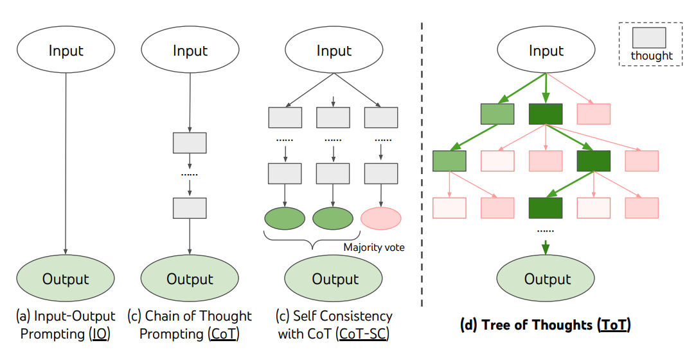
图片援引自：[Yao et el. (2023)](https://arxiv.org/abs/2305.10601)

ToT 需要针对不同的任务定义思维/步骤的数量以及每步的候选项数量。例如，论文中的“算 24 游戏”是一种数学推理任务，需要分成 3 个思维步骤，每一步都需要一个中间方程。而每个步骤保留最优的（best） 5 个候选项。

ToT 完成算 24 的游戏任务要执行广度优先搜索（BFS），每步思维的候选项都要求 LM 给出能否得到 24 的评估：“sure/maybe/impossible”（一定能/可能/不可能） 。作者讲到：“目的是得到经过少量向前尝试就可以验证正确（sure）的局部解，基于‘太大/太小’的常识消除那些不可能（impossible）的局部解，其余的局部解作为‘maybe’保留。”每步思维都要抽样得到 3 个评估结果。整个过程如下图所示：

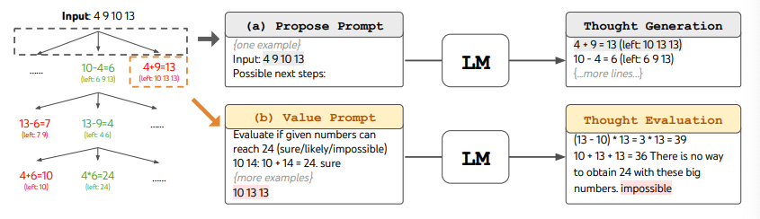

图片援引自：[Yao et el. (2023)](https://arxiv.org/abs/2305.10601)

从下图中报告的结果来看，ToT 的表现大大超过了其他提示方法：

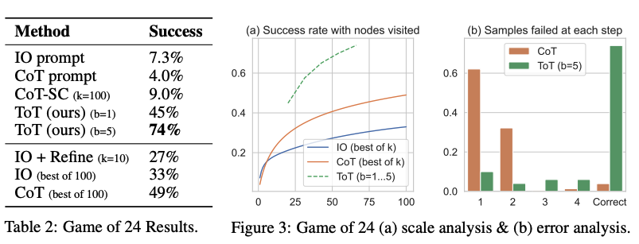

图片援引自：[Yao et el. (2023)](https://arxiv.org/abs/2305.10601)

[这里](https://github.com/princeton-nlp/tree-of-thought-llm)还有[这里](https://github.com/jieyilong/tree-of-thought-puzzle-solver)可以找到代码例子。

从大方向上来看，[Yao et el. (2023)](https://arxiv.org/abs/2305.10601) 和 [Long (2023)](https://arxiv.org/abs/2305.08291) 的核心思路是类似的。两种方法都是以多轮对话搜索树的形式来增强 LLM 解决复杂问题的能力。主要区别在于 [Yao et el. (2023)](https://arxiv.org/abs/2305.10601) 采用了深度优先（DFS）/广度优先（BFS）/集束（beam）搜索，而 [Long (2023)](https://arxiv.org/abs/2305.08291) 则提出由强化学习（Reinforcement Learning）训练出的 “ToT 控制器”（ToT Controller）来驱动树的搜索策略(宝库什么时候回退和搜索到哪一级回退等等)。深度优先/广度优先/集束搜索是通用搜索策略，并不针对具体问题。相比之下，由强化学习训练出的 ToT 控制器有可能从新的数据集学习，或是在自对弈（AlphaGo vs. 蛮力搜索）的过程中学习。因此，即使采用的是冻结的 LLM，基于强化学习构建的 ToT 系统仍然可以不断进化，学习新的知识。

[Hulbert (2023)](https://github.com/dave1010/tree-of-thought-prompting) 提出了思维树（ToT）提示法，将 ToT 框架的主要概念概括成了一段简短的提示词，指导 LLM 在一次提示中对中间思维做出评估。ToT 提示词的例子如下：

```
假设三位不同的专家来回答这个问题。
所有专家都写下他们思考这个问题的第一个步骤，然后与大家分享。
然后，所有专家都写下他们思考的下一个步骤并分享。
以此类推，直到所有专家写完他们思考的所有步骤。
只要大家发现有专家的步骤出错了，就让这位专家离开。
请问...
```

## 检索增强生成 (RAG)


通用语言模型通过微调就可以完成几类常见任务，比如分析情绪和识别命名实体。这些任务不需要额外的背景知识就可以完成。

要完成更复杂和知识密集型的任务，可以基于语言模型构建一个系统，访问外部知识源来做到。这样的实现与事实更加一性，生成的答案更可靠，还有助于缓解“幻觉”问题。

Meta AI 的研究人员引入了一种叫做[检索增强生成（Retrieval Augmented Generation，RAG）](https://ai.facebook.com/blog/retrieval-augmented-generation-streamlining-the-creation-of-intelligent-natural-language-processing-models/)的方法来完成这类知识密集型的任务。RAG 把一个信息检索组件和文本生成模型结合在一起。RAG 可以微调，其内部知识的修改方式很高效，不需要对整个模型进行重新训练。

RAG 会接受输入并检索出一组相关/支撑的文档，并给出文档的来源（例如维基百科）。这些文档作为上下文和输入的原始提示词组合，送给文本生成器得到最终的输出。这样 RAG 更加适应事实会随时间变化的情况。这非常有用，因为 LLM 的参数化知识是静态的。RAG 让语言模型不用重新训练就能够获取最新的信息，基于检索生成产生可靠的输出。

Lewis 等人（2021）提出一个通用的 RAG 微调方法。这种方法使用预训练的 seq2seq 作为参数记忆，用维基百科的密集向量索引作为非参数记忆（使通过神经网络预训练的检索器访问）。这种方法工作原理概况如下：

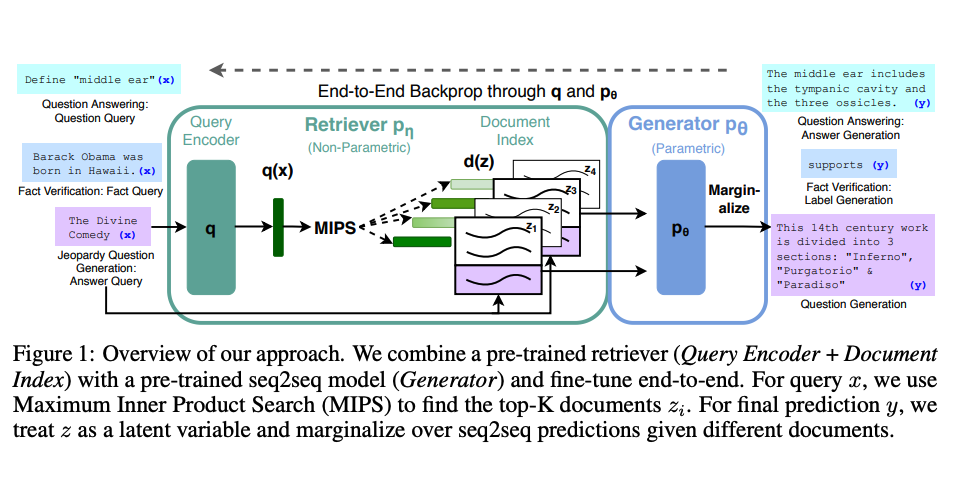

图片援引自: [Lewis et el. (2021)](https://arxiv.org/pdf/2005.11401.pdf)

RAG 在 [Natural Questions](https://ai.google.com/research/NaturalQuestions)、[WebQuestions](https://paperswithcode.com/dataset/webquestions) 和 CuratedTrec 等基准测试中表现抢眼。用 MS-MARCO 和 Jeopardy 问题进行测试时，RAG 生成的答案更符合事实、更具体、更多样。FEVER 事实验证使用 RAG 后也得到了更好的结果。

这说明 RAG 是一种可行的方案，能在知识密集型任务中增强语言模型的输出。

最近，基于检索器的方法越来越流行，经常与 ChatGPT 等流行 LLM 结合使用来提高其能力和事实一致性。

LangChain 文档中可以找到[一个使用检索器和 LLM 回答问题并给出知识来源的简单例子](https://python.langchain.com/docs/use_cases/question_answering/how_to/vector_db_qa)。


## 自动推理并使用工具 (ART)


使用 LLM 完成任务时，交替运用 CoT 提示和工具已经被证明是一种即强大又稳健的方法。这类方法通常需要针对特定任务手写示范，还需要精心编写交替使用生成模型和工具的脚本。[Paranjape et al., (2023)](https://arxiv.org/abs/2303.09014)提出了一个新框架，该框架使用冻结的 LLM 来自动生成包含中间推理步骤的程序。

ART（Automatic Reasoning and Tool-use）的工作原理如下：
- 接到一个新任务的时候，从任务库中选择多步推理和使用工具的示范。
- 在测试中，调用外部工具时，先暂停生成，将工具输出整合后继续接着生成。

ART 引导模型总结示范，将新任务进行拆分并在恰当的地方使用工具。ART 采用的是零样本形式。ART 还可以手动扩展，只要简单地更新任务和工具库就可以修正推理步骤中的错误或是添加新的工具。这个过程如下：
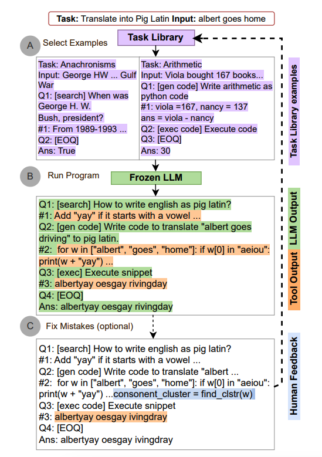
图片援引自: [Paranjape et al., (2023)](https://arxiv.org/abs/2303.09014)

在 BigBench 和 MMLU 基准测试中，ART 在未见任务上的表现大大超过了少样本提示和自动 CoT；配合人类反馈后，其表现超过了手写的 CoT 提示。

下面这张表格展示了 ART 在 BigBench 和 MMLU 任务上的表现：
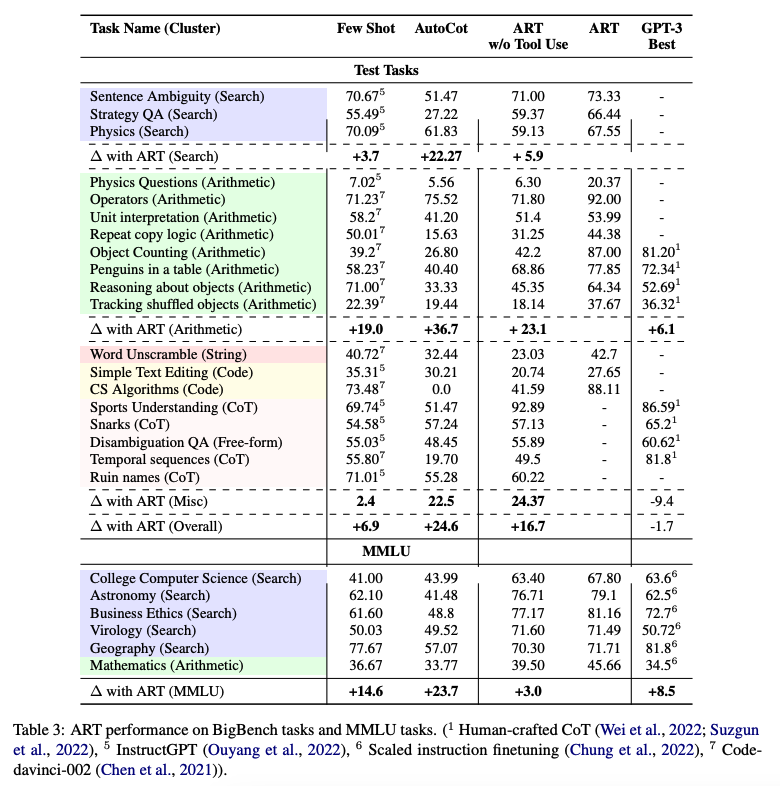
图片援引自: [Paranjape et al., (2023)](https://arxiv.org/abs/2303.09014)


## 自动提示工程师（APE）


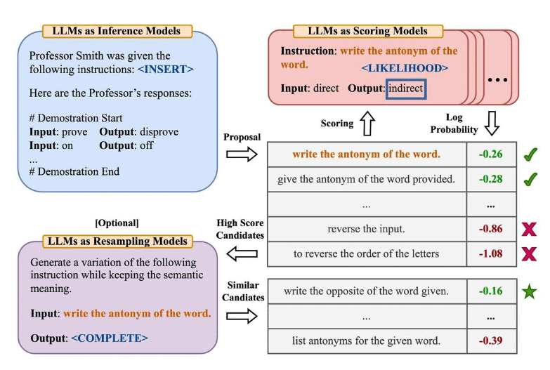
图片来源：[Zhou等人，（2022）](https://arxiv.org/abs/2211.01910)

[Zhou等人，（2022）](https://arxiv.org/abs/2211.01910) 提出了自动提示工程师（APE），这是一个用于自动指令生成和选择的框架。指令生成问题被构建为自然语言合成问题，使用LLMs作为黑盒优化问题的解决方案来生成和搜索候选解。

第一步涉及一个大型语言模型（作为推理模型），该模型接收输出演示以生成任务的指令候选项。这些候选解将指导搜索过程。使用目标模型执行指令，然后根据计算的评估分数选择最合适的指令。

APE发现了一个比人工设计的“让我们一步一步地思考”提示更好的零样本CoT提示（[Kojima等人，2022](https://arxiv.org/abs/2205.11916)）。

提示“让我们一步一步地解决这个问题，以确保我们有正确的答案。”引发了思维链的推理，并提高了MultiArith和GSM8K基准测试的性能：

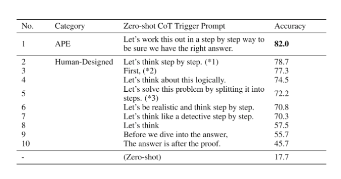
图片来源：[Zhou等人，（2022）](https://arxiv.org/abs/2211.01910)

本文涉及与提示工程相关的重要主题，即自动优化提示的想法。虽然我们在本指南中没有深入探讨这个主题，但如果您对此主题感兴趣，以下是一些关键论文：

- [AutoPrompt](https://arxiv.org/abs/2010.15980) - 提出了一种基于梯度引导搜索的方法，用于自动创建各种任务的提示。
- [Prefix Tuning](https://arxiv.org/abs/2101.00190) - 是一种轻量级的fine-tuning替代方案，为NLG任务添加可训练的连续前缀。
- [Prompt Tuning](https://arxiv.org/abs/2104.08691) - 提出了一种通过反向传播学习软提示的机制。


## Active-Prompt

思维链（CoT）方法依赖于一组固定的人工注释范例。问题在于，这些范例可能不是不同任务的最有效示例。为了解决这个问题，[Diao等人（2023）](https://arxiv.org/pdf/2302.12246.pdf)最近提出了一种新的提示方法，称为Active-Prompt，以适应LLMs到不同的任务特定示例提示（用人类设计的CoT推理进行注释）。

下面是该方法的说明。第一步是使用或不使用少量CoT示例查询LLM。对一组训练问题生成*k*个可能的答案。基于*k*个答案计算不确定度度量（使用不一致性）。选择最不确定的问题由人类进行注释。然后使用新的注释范例来推断每个问题。

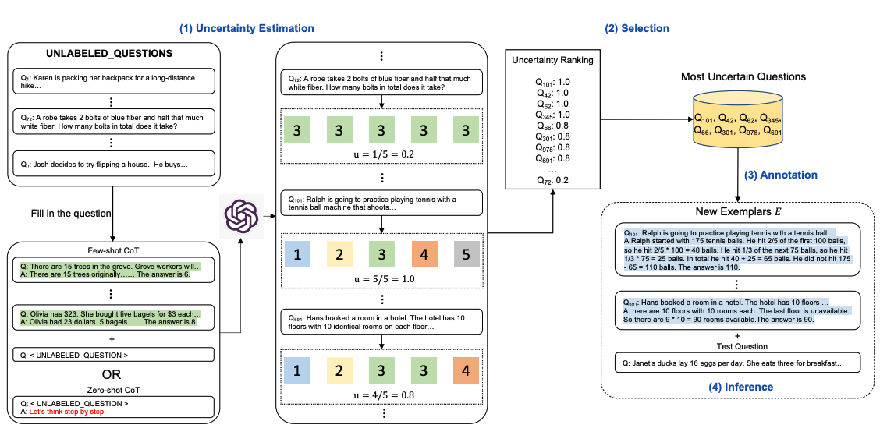

图片来源：[Diao等人（2023）](https://arxiv.org/pdf/2302.12246.pdf)


### 方向性刺激提示

[Li等人，（2023）](https://arxiv.org/abs/2302.11520)提出了一种新的提示技术，以更好地指导LLM生成所需的摘要。

训练了一个可调节的策略LM来生成刺激/提示。越来越多地使用RL来优化LLM。

下图显示了方向性刺激提示与标准提示的比较。策略LM可以很小，并且可以优化以生成指导黑盒冻结LLM的提示。

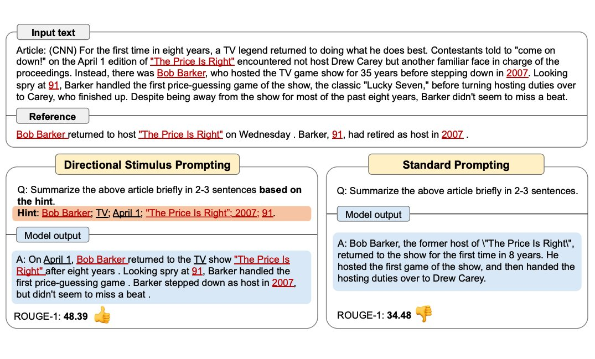
图片来源：[Li等人，（2023）](https://arxiv.org/abs/2302.11520)

完整示例即将推出！


## PAL（程序辅助语言模型）

[Gao等人（2022）](https://arxiv.org/abs/2211.10435)提出了一种使用LLMs读取自然语言问题并生成程序作为中间推理步骤的方法。被称为程序辅助语言模型（PAL），它与思维链提示不同，因为它不是使用自由形式文本来获得解决方案，而是将解决步骤卸载到类似Python解释器的编程运行时中。


图片来源：[Gao等人（2022）](https://arxiv.org/abs/2211.10435)

让我们以LangChain和OpenAI GPT-3为例。我们有兴趣开发一个简单的应用程序，它能够解释所提出的问题，并利用Python解释器提供答案。

具体来说，我们有兴趣创建一个功能，允许使用LLM回答需要日期理解的问题。我们将为LLM提供一个提示，其中包括一些示例，这些示例是从[这里](https://github.com/reasoning-machines/pal/blob/main/pal/prompt/date_understanding_prompt.py)采用的。

这是我们需要导入的包：

```python
import openai
from datetime import datetime
from dateutil.relativedelta import relativedelta
import os
from langchain.llms import OpenAI
from dotenv import load_dotenv
```

让我们先配置一些环境：

```python
load_dotenv()

# API configuration
openai.api_key = os.getenv("OPENAI_API_KEY")

# for LangChain
os.environ["OPENAI_API_KEY"] = os.getenv("OPENAI_API_KEY")
```

设置模型实例：

```python
llm = OpenAI(model_name='text-davinci-003', temperature=0)
```

设置提示+问题：

```python
question = "Today is 27 February 2023. I was born exactly 25 years ago. What is the date I was born in MM/DD/YYYY?"

DATE_UNDERSTANDING_PROMPT = """
# Q: 2015 is coming in 36 hours. What is the date one week from today in MM/DD/YYYY?
# If 2015 is coming in 36 hours, then today is 36 hours before.
today = datetime(2015, 1, 1) - relativedelta(hours=36)
# One week from today,
one_week_from_today = today + relativedelta(weeks=1)
# The answer formatted with %m/%d/%Y is
one_week_from_today.strftime('%m/%d/%Y')
# Q: The first day of 2019 is a Tuesday, and today is the first Monday of 2019. What is the date today in MM/DD/YYYY?
# If the first day of 2019 is a Tuesday, and today is the first Monday of 2019, then today is 6 days later.
today = datetime(2019, 1, 1) + relativedelta(days=6)
# The answer formatted with %m/%d/%Y is
today.strftime('%m/%d/%Y')
# Q: The concert was scheduled to be on 06/01/1943, but was delayed by one day to today. What is the date 10 days ago in MM/DD/YYYY?
# If the concert was scheduled to be on 06/01/1943, but was delayed by one day to today, then today is one day later.
today = datetime(1943, 6, 1) + relativedelta(days=1)
# 10 days ago,
ten_days_ago = today - relativedelta(days=10)
# The answer formatted with %m/%d/%Y is
ten_days_ago.strftime('%m/%d/%Y')
# Q: It is 4/19/1969 today. What is the date 24 hours later in MM/DD/YYYY?
# It is 4/19/1969 today.
today = datetime(1969, 4, 19)
# 24 hours later,
later = today + relativedelta(hours=24)
# The answer formatted with %m/%d/%Y is
today.strftime('%m/%d/%Y')
# Q: Jane thought today is 3/11/2002, but today is in fact Mar 12, which is 1 day later. What is the date 24 hours later in MM/DD/YYYY?
# If Jane thought today is 3/11/2002, but today is in fact Mar 12, then today is 3/12/2002.
today = datetime(2002, 3, 12)
# 24 hours later,
later = today + relativedelta(hours=24)
# The answer formatted with %m/%d/%Y is
later.strftime('%m/%d/%Y')
# Q: Jane was born on the last day of Feburary in 2001. Today is her 16-year-old birthday. What is the date yesterday in MM/DD/YYYY?
# If Jane was born on the last day of Feburary in 2001 and today is her 16-year-old birthday, then today is 16 years later.
today = datetime(2001, 2, 28) + relativedelta(years=16)
# Yesterday,
yesterday = today - relativedelta(days=1)
# The answer formatted with %m/%d/%Y is
yesterday.strftime('%m/%d/%Y')
# Q: {question}
""".strip() + '\n'
```

```python
llm_out = llm(DATE_UNDERSTANDING_PROMPT.format(question=question))
print(llm_out)
```

```python
exec(llm_out)
print(born)
```

这将输出以下内容：`02/27/1998`

## ReAct 框架

从 [Yao等人，2022](https://arxiv.org/abs/2210.03629) 引入了一个框架，其中 LLMs 以交错的方式生成 *推理轨迹* 和 *任务特定操作* 。

生成推理轨迹使模型能够诱导、跟踪和更新操作计划，甚至处理异常情况。操作步骤允许与外部源（如知识库或环境）进行交互并且收集信息。

ReAct 框架允许 LLMs 与外部工具交互来获取额外信息，从而给出更可靠和实际的回应。

结果表明，ReAct 可以在语言和决策任务上的表现要高于几个最先进水准要求的的基线。ReAct 还提高了 LLMs 的人类可解释性和可信度。总的来说，作者发现了将 ReAct 和链式思考 (CoT) 结合使用的最好方法是在推理过程同时使用内部知识和获取到的外部信息。

### 它是如何运作的?

ReAct 的灵感来自于 “行为” 和 “推理” 之间的协同作用，正是这种协同作用使得人类能够学习新任务并做出决策或推理。

链式思考 (CoT) 提示显示了 LLMs 执行推理轨迹以生成涉及算术和常识推理的问题的答案的能力，以及其他任务 [(Wei等人，2022)](https://arxiv.org/abs/2201.11903)。但它因缺乏和外部世界的接触或无法更新自己的知识，而导致事实幻觉和错误传播等问题。

ReAct 是一个将推理和行为与 LLMs 相结合通用的范例。ReAct 提示 LLMs 为任务生成口头推理轨迹和操作。这使得系统执行动态推理来创建、维护和调整操作计划，同时还支持与外部环境(例如，Wikipedia)的交互，以将额外信息合并到推理中。下图展示了 ReAct 的一个示例以及执行问题回答所涉及的不同步骤。

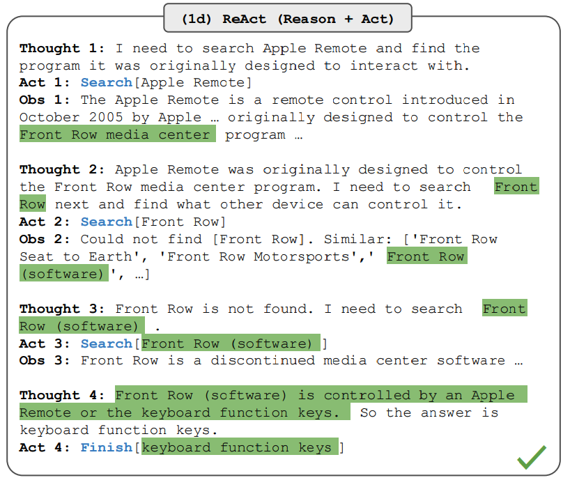

图片来源：[Yao等人，2022](https://arxiv.org/abs/2210.03629)

在上面的例子中，我们将如下问题作为提示给出，该问题出自 [HotpotQA](https://hotpotqa.github.io/)：

```
除了苹果遥控器，还有哪些设备可以控制苹果遥控器最初设计用来交互的程序?
```

请注意，上下文中的示例也被添加到提示符中，但为了简单起见，我们在这里排除了它。我们可以看到，该模型生成了 “任务解决轨迹” (思考，行动)。Obs 对应与之交互的环境的观察 (例如搜索引擎)。从本质上讲，ReAct 可以检索信息来支持推理，而推理则有助于确定下一步检索的目标。

### ReAct 提示
为了更好的阐释 ReAct 提示是如何运作的，我们继续跟随论文的示例。

第一步是从训练集 (例如 HotPotQA) 中选择案例，并组成 ReAct 格式的轨迹。这些在提示中作为少样本示例。轨迹由多思考-操作-观察步骤组成，如图所示。自由形式的思考用来完成不同的任务，如分解问题、提取信息、执行常识或算术推理、引导搜索公式和合成最终答案。

下面是一个 ReAct 提示的示例(摘自论文，为简单起见缩短为一个示例):

```
问题 科罗拉多造山带东部区域延伸到的区域的海拔范围是多少?
思考 1 我需要搜索科罗拉多造山带，找到科罗拉多造山带东段延伸的区域，然后找到该区域的海拔范围。
操作 1 搜索 [科罗拉多造山带]
观察 1 科罗拉多造山带是科罗拉多及其周边地区造山运动的一段。
思考 2 它没有提到东部地区。所以我需要查一下东部地区。
操作 2 查找 [东部地区]
观察 2 (结果 1 / 1) 东部区域延伸至高平原，称为中原造山带。
思考 3 科罗拉多造山运动的东部区域延伸到高平原。所以我需要搜索高平原，找到它的海拔范围。
操作 3 搜索 [高平原]
观察 3 高平原指的是两个截然不同的陆地区域之一。
思考 4 我需要搜索高平原（美国）
操作 4 搜索 [高平原（美国）]
观察 4 高平原是大平原的一个分区。从东到西，高平原的海拔从 1800 到 7000 英尺 (550 到 2130 米) 不等。[3]
思考 5 高平原海拔高度从 1800 到 7000 英尺，所以答案是 1800 到 7000 英尺。
操作 5 结束 [1800 到 7000 英尺]
...
```

请注意，不同的提示设置用于不同类型的任务。对那些以推理为主要目标的任务 (例如 HotpotQA)，多思考-操作-观察步骤用于任务-解决轨迹。对于涉及许多操作步骤的决策任务来说，则较少使用思考。

## 在知识密集型任务上的表现结果

论文首先对 ReAct 在知识密集型推理任务如问答 (HotPotQA) 和事实验证 ([Fever](https://fever.ai/resources.html)) 上进行了评估。PaLM-540B 作为提示的基本模型。
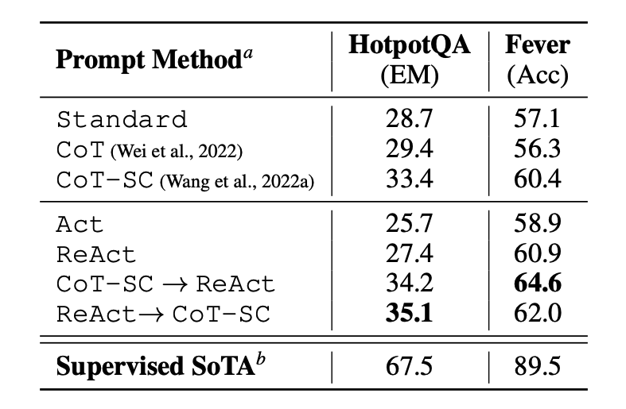
图片来源: [Yao et al., 2022](https://arxiv.org/abs/2210.03629)

通过在 HotPotQA 和 Fever 上使用不同提示方法得到的提示的表现结果说明了 ReAct 表现结果通常优于 Act (只涉及操作)。

我们还可以观察到 ReAct 在 Fever 上的表现优于 CoT，而在 HotpotQA 上落后于 CoT。文中对该方法进行了详细的误差分析。总而言之:

- CoT 存在事实幻觉的问题
- ReAct 的结构性约束降低了它在制定推理步骤方面的灵活性
- ReAct 在很大程度上依赖于它正在检索的信息;非信息性搜索结果阻碍了模型推理，并导致难以恢复和重新形成思想

结合并支持在 ReAct 和链式思考+自我一致性之间切换的提示方法通常优于所有其他提示方法。

### 在决策型任务上的表现结果

论文还给出了 ReAct 在决策型任务上的表现结果。ReAct 基于两个基准进行评估，分别是 [ALFWorld](https://alfworld.github.io/) (基于文本的游戏) 和 [WebShop](https://webshop-pnlp.github.io/) (在线购物网站环境)。两者都涉及复杂的环境，需要推理才能有效地行动和探索。

请注意，虽然对这些任务的 ReAct 提示的设计有很大不同，但仍然保持了相同的核心思想，即结合推理和行为。下面是一个涉及 ReAct 提示的 ALFWorld 问题示例。
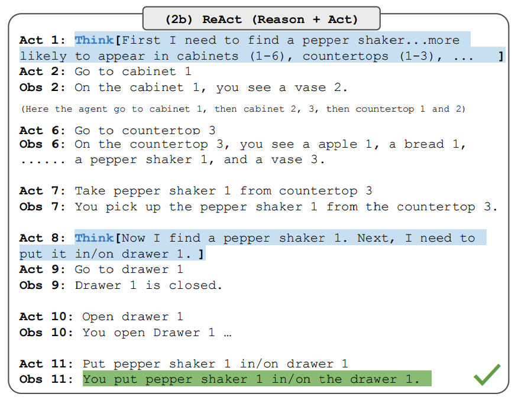

图片来源: [Yao et al., 2022](https://arxiv.org/abs/2210.03629)

ReAct 在 ALFWorld 和 Webshop 上都优于 Act。没有思考的 Act 不能正确地把目标分解成子目标。尽管在这些类型的任务中，ReAct 的推理显露出优势，但目前基于提示的方法在这些任务上的表现与人类专家相差甚远。

查看这篇论文了解结果详情。

### 长链 ReAct 的使用

下面是 ReAct 提示方法在实践中如何工作的高阶示例。我们将在 LLM 和 [长链](https://python.langchain.com/en/latest/index.html) 中使用OpenAI，因为它已经具有内置功能，可以利用 ReAct 框架构建代理，这些代理能够结合 LLM 和其他多种工具的功能来执行任务。

首先，让我们安装并导入必要的库:

``` python
%%capture
# 更新或安装必要的库
!pip install --upgrade openai
!pip install --upgrade langchain
!pip install --upgrade python-dotenv
!pip install google-search-results

# 引入库
import openai
import os
from langchain.llms import OpenAI
from langchain.agents import load_tools
from langchain.agents import initialize_agent
from dotenv import load_dotenv
load_dotenv()

# 载入 API keys; 如果没有，你需要先获取。 
os.environ["OPENAI_API_KEY"] = os.getenv("OPENAI_API_KEY")
os.environ["SERPER_API_KEY"] = os.getenv("SERPER_API_KEY")

```

现在我们可以配置 LLM，我们要用到的工具，以及允许我们将 ReAct 框架与 LLM 和其他工具结合使用的代理。请注意，我们使用搜索 API 来搜索外部信息，并使用 LLM 作为数学工具。

``` python
llm = OpenAI(model_name="text-davinci-003" ,temperature=0)
tools = load_tools(["google-serper", "llm-math"], llm=llm)
agent = initialize_agent(tools, llm, agent="zero-shot-react-description", verbose=True)
```

配置好之后，我们就可以用所需的查询或提示运行代理了。请注意，在这里，我们不会像论文中阐释的那样提供少样本的示例。

``` python
agent.run("奥利维亚·王尔德的男朋友是谁?他现在的年龄的0.23次方是多少?")
```

链执行如下所示:

``` yaml
> 正在输入新代理执行器链......
  我得查出奥利维亚·王尔德的男友是谁然后计算出他的年龄的 0.23 次方。
操作: 搜索
操作输入: “奥利维亚·王尔德的男友”
观察: 奥利维亚·王尔德与杰森·苏代基斯在多年前订婚，在他们分手后，她开始与哈里·斯泰尔斯约会 — 参照他们的关系时间线。
思考: 我需要找出哈里·斯泰尔斯的年龄。
操作: 搜索
操作输入: “哈里·斯泰尔斯的年龄”
观察: 29 岁
思考: 我需要计算 29 的 0.23 次方。
操作: 计算器
操作输入: 29^0.23
观察: 答案: 2.169459462491557

思考: 现在我知道最终答案了。
最终答案: 哈里·斯泰尔斯, 奥利维亚·王尔德的男朋友, 29 岁。他年龄的 0.23 次方是 2.169459462491557。

> 结束链。
```

我们得到如下输出:

```
"哈里·斯泰尔斯, 奥利维亚·王尔德的男朋友, 29 岁。他年龄的 0.23 次方是 2.169459462491557。"
```

这个例子我们摘自 [LangChain 文档](https://python.langchain.com/docs/modules/agents) 并修改，所以这些都要归功于他们。我们鼓励学习者去探索工具和任务的不同组合。

您可以在这里找到这些代码: https://github.com/dair-ai/Prompt-Engineering-Guide/blob/main/notebooks/react.ipynb

## 多模态思维链提示方法


最近，[Zhang等人（2023）](https://arxiv.org/abs/2302.00923)提出了一种多模态思维链提示方法。传统的思维链提示方法侧重于语言模态。相比之下，多模态思维链提示将文本和视觉融入到一个两阶段框架中。第一步涉及基于多模态信息的理性生成。接下来是第二阶段的答案推断，它利用生成的理性信息。

多模态CoT模型（1B）在ScienceQA基准测试中的表现优于GPT-3.5。

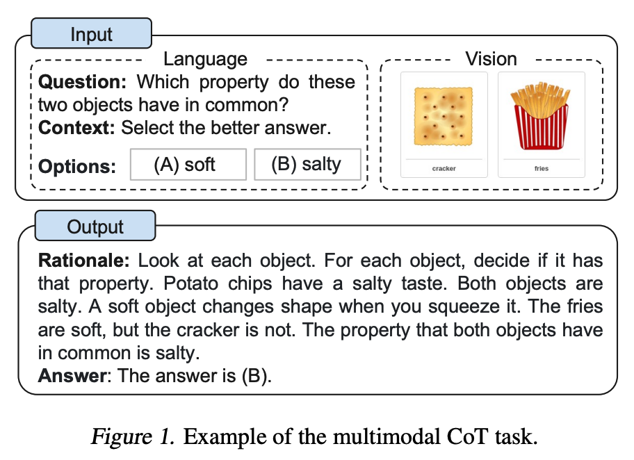
图片来源：[Zhang et al. (2023)](https://arxiv.org/abs/2302.00923)

进一步阅读：
- [语言不是你所需要的全部：将感知与语言模型对齐](https://arxiv.org/abs/2302.14045)（2023年2月）


## GraphPrompts

[Liu等人，2023](https://arxiv.org/abs/2302.08043)介绍了GraphPrompt，一种新的图形提示框架，用于提高下游任务的性能。

更多内容即将到来！