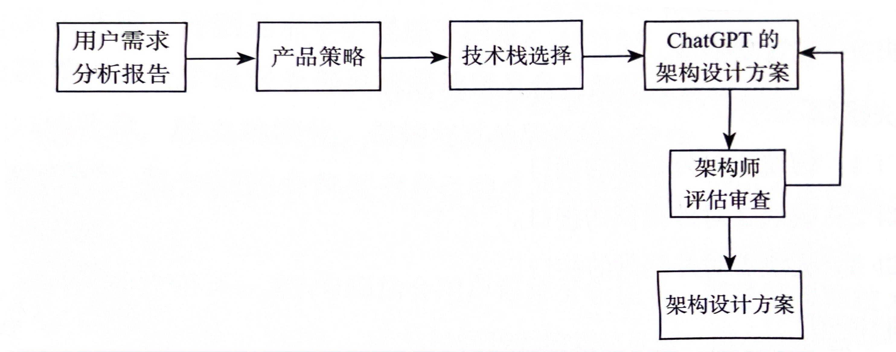

# 新模式下的软件开发

## ChatGPT 驱动需求分析


## ChatGPT 驱动架构设计

### 典型软件架构设计过程

- （1）需求分析：架构师需要充分了解和分析业务需求、功能需求、性能需求和安全需求。这个阶段的目标是为后续的架构设计提供明确的指导。
- （2）系统分解：根据需求分析结果，将整个软件系统划分为多个模块或子系统，以便实现系统功能的模块化和解耦。此阶段需考虑模块间的职责划分、依赖关系和通信方式。
- （3）技术选型：基于项目需求、预算和团队技能等因素，选择合适的技术栈，如编程语言、框架、数据库和消息队列等。技术选型对架构的可行性、性能和可维护性具有重大影响。
- （4）架构风格：架构师需要根据项目特点选择合适的架构风格（如微服务架构、事件驱动架构等），以满足系统的可扩展性、可维护性等需求。
- （5）接口定义：定义模块之间的接口、数据结构和通信协议，以实现模块间的互操作性和可扩展性，为后续接口的具体实现确定框架。
- （6）安全性与可靠性设计：评估和规划系统的安全措施、容错策略、备份和恢复机制等，以确保系统的安全性和可靠性。
- （7）性能优化：对性能关键部分进行优化，包括算法、数据结构和缓存策略等。关注系统的负载均衡、并发控制和资源管理，确保系统具有良好的性能。
- （8）架构评审与验证：架构设计完成后，需要对架构进行评审，检查架构是否满足需求、是否存在潜在问题。必要时，可通过原型或模拟验证架构的可行性。
- （9）架构文档与传递：编写详细的架构文档，包括设计、模块划分和接口定义等。这些文档将成为开发团队的重要参考。同时，将架构设计传递给开发团队，确保团队顺利执行。

敏捷开发需要交付和运行独立自主的微服务以灵活、快速地应应对用户需求，容器化可以最小化资源，而且可以快速部署、灵活扩展。并且微服务架构每个模块都相对杜丽华，ChatGPT 更擅长进行这种微服务架构的设计。

### 微服务简介

大约在2010年左右，微服务架构作为一核心思想是将软件系统分解为多个独立、可独立部署和扩展的小型服务。这些微服务通常围绕具体业务功能进行设计，具有较高的内聚性和较低的耦合度。微服务架构克服了传统SOA的一些缺陷，如复杂的集成和管理，提供了更加灵活和轻量级的解决方案。
微服务架构是一种软件开发和部署的方法，它将大型的复杂应用程序分解为一组相互独立、可扩展、可维护的微小服务。每个服务负责执行特定的功能，且可以独立地开发、测试、部署和扩展，以实现高内聚、低耦合。除了架构设计方法之外，与微服务伴生的还有敏捷开发、持续集成／持续交付、云计算和容器技术。微服务架构的设计过程与传统软件架构的设计过程在很多方面是相似的，但它也具有一些特定的关注点和挑战。
- 服务划分：在微服务架构中，关键任务之一是确定如何将应用程序划分为适当大小的微服务。这通常涉及识别有界上下文（Bounded Context）并根据业务功能或领域驱动设计（Domain-Driven Design，DDD）原则进行划分。
- 服务独立性：微服务应当具有独立性，这意味着每个服务应该能够独立部署、扩展和维护。在设计时，应考虑到服务之间的解耦和依赖最小化。
□服务间通信：微服务架构中的服务需要通过某种通信机制相互协作。架构师需要在同步通信（如RESTful API、gRPC等）和异步通信（如消息队列、事件驱动等）之间进行权衡，并设计合适的通信协议和数据格式。
- 数据一致性和管理：由于每个微服务具有独立的数据存储，因此需要解决数据一致性和管理的问题。这可能涉及使用事件溯源、CQRS（命令查询职责分离）等模式来解决跨服务的数据一致性问题。
- 容错和弹性设计：微服务架构中的服务可能会发生故障，因此需要考虑容错和弹性设计。这可能需要使用熔断器、限流器等模式以及优雅降级策略来解决服务故障问题。
- 服务发现和负载均衡：随着服务数量的增加，服务发现和负载均衡变得越来越重要。架构师需要考虑使用服务注册中心、API网关等工具来解决这些问题。
- 部署和运维：随着微服务架构中服务数量的增加，部署和运维变得更加复杂。架构师需要关注如何实现自动化部署、监控和日志管理等运维任务。容器化技术（如Docker）和容器编排平台（如Kubernetes）在这方面发挥了重要作用。
- 跨团队协作：微服务架构通常要求开发团队按照业务功能进行组织，以便更好地协同工作。因此，在设计微服务架构时，需要考虑团队的组织结构和沟通方式。
- API管理和版本控制：微服务架构中的服务之间通过API进行通信，因此需要考虑API的管理和版本控制。这可能涉及使用API网关、API文档生成工具（如Swagger）以及制定适当的API版本控制策略。
- 安全和认证：微服务架构中的服务可以独立部署，因此需要考虑如何确保服务之间的安全通信和访问控制。这可能涉及使用OAuth、JWT等认证和授权机制，以及使用API网关来集中管理访问策略。
- 监控和追踪：由于微服务架构中的服务相互独立，需要实现分布式监控和追踪，以便及时发现和解决问题。这可能需要使用分布式追踪工具（如Zipkin、Jaeger等）和集中式日志管理系统（如ELK Stack）。

### 微服务架构设计原则

在利用ChatGPT驱动微服务架构的软件开发过程中，我们仍然要遵守微服务架构的设计原则和最佳实践，不过可以更加聚焦在真实业务逻辑的理解与描述上。在微服务架构的设计过程中，我们需要遵循以下几个原则。
- 单一职责原则：每个微服务都应该负责一个明确的业务功能，以便于独立开发、测试与维护。这个原则的执行要适当，不要无限度地拆分。在拆分的过程中需要考虑团队规模、技能和分工等问题。
- 松耦合的原则：微服务之间应该尽量减少直接的依赖关系，以提高灵活性与可扩展性。这个原则如果贯彻得不好会造成服务之间缺乏相对独立性，为后续的应用管理和维护，特别是水平扩展埋下隐患。
- 场景约束原则：每个微服务都要清楚地定义自己的场景逻辑边界，让每个服务可以独立地开发，独立地演化，保持与其他服务的一致性。
- 自主自治原则：每个微服务都要有自己独立的数据模型，可以自主管理其内部的状态与数据。
在上述四个原则的指导下，架构师结合用户需求分析报告、产品策略和技术栈选择，定义并设计好每个微服务。例如，定义如何进行数据流处理、服务之间的通信、数据存储、身份验证与授权、性能优化、容器化部署以及监控与报警等这些具体的内容。

## 我们需要在 ChatGPT 的帮助下完成下面这些架构设计



1．系统概述
- 用户需求：描述了用户需求和期望。
- 系统目标：定义了系统的目标和愿景。
- 系统功能：列出了系统的核心功能和特性。
2．架构风格
从众多架构风格中选一种，以适合自己团队和项目的现实需要。
3．模块划分
- 模块1：包含功能1。
- 模块2：包含功能2。
- 模块3：包含功能3。
4．模块接口
- 接口1：模块1对外提供的接口。
- 接口2：模块2对外提供的接口。
- 接口3：模块3对外提供的接口。
5．数据模型
- 数据结构1：模块1使用的数据结构。
- 数据结构2：模块2使用的数据结构。
- 数据结构3：模块3使用的数据结构。
6．技术选型
包括编程语言、框架与库、数据库、消息队列、缓存技术、容器和虚拟化、持续集成和持续部署（CI／CD）工具、监控和日志分析等。
7．安全与可靠性设计
- 安全措施：采用SSL／TLS、OAuth2、JWT等安全措施。
- 容错策略：采用分布式事务、重试机制、备份和恢复机制等容错策略。
- 备份和恢复机制：包括数据备份、数据恢复、灾备方案等。
8．性能优化
- 算法优化：优化复杂度高的算法。
- 数据结构优化：采用合适的数据结构。
- 缓存策略优化：采用合适的缓存策略。
- 负载均衡：使用负载均衡技术。
- 并发控制：采用合适的并发控制方式。
- 资源管理：优化资源使用和管理。
9．部署与运维
采用自动化部署、灰度发布等。

### 需要的背景资料包括
- 用户需求分析报告、用户画像和需求规格说明书
- 架构师结合公司的团队情况、既有系统、技术规范等总结出来的TMS技术栈、组件、功能模块、数据流和通信方式
- 以架构设计文档为框架和主线，逐步深入，最后整合出TMS架构设计文档。

### 借助 ChatGPT 完成架构设计

```
❓
1．项目背景
某支付公司计划开发TMS，用以管理部署在各地的POS机。主要目的是更好地开展信用卡收单业务，有效管理大量为商户配置的POS机。
服务对象：支付公司部署在各地的POS机。
目标用户：支付公司内部的POS机管理者。
核心功能：软件管理、密钥管理、设备管理、参数管理。
用户规模：5个POS机管理员。
终端数量：目前已经有100万台POS机。
性能要求：50个并发请求，3s响应。
安全要求：能通过PCI-DSS认证。
扩展要求：可以随着业务的发展无障碍扩展。
2．功能层次划分
各层功能模块分解如下。
- 核心服务层：设备管理、参数管理、软件管理和密钥管理。
- 支撑服务层：远程支持、日志管理、通知管理和用户管理。
3．系统概述
用户需求：描述了用户需求和期望。
系统目标：定义了系统的目标和愿景。
系统功能：列出了系统的核心功能和支撑功能。
4．架构风格
微服务架构：采用微服务架构风格，将系统拆分成多个独立的服务。
5．模块划分
模块1：包含功能1。
模块2：包含功能2。
模块3：包含功能3。
请分析上面的信息，然后设计出总体架构。
```

✡️
1．系统概述
用户需求：某支付公司计划开发TMS应用，用以管理部署在各地的POS机主要目的是更好地开展信用卡收单业务，有效管理大量为商户配置的POS机。
系统目标：对部署在各地的POS机进行有效的管理和维护，提高信用卡收单业务的效率和安全性。
系统功能：
- 核心功能层：软件管理、密钥管理、设备管理、参数管理。
- 支撑功能层：远程支持、日志管理、通知管理、用户管理。

2．架构风格
微服务架构：采用微服务架构风格，将系统拆分成多个独立的服务，以提高系统的可维护性和可扩展性。
3．模块划分

    |  模块名称    |   模块描述  |
    |  ----  | ----  |
    | 设备管理 | 设备信息查询、设备状态监控、设备远程操作等功能 |
    | 参数管理 | 参数设置、参数更新、参数查询等功能 |
    | 软件管理 | 软件版本控制、软件更新、软件安装和卸载等功能 |
    | 密钥管理 | 密钥生成、密钥更新、密钥分发、密钥注销等功能 |
    | 远程支持 | 远程连接POS机、远程维护等功能 |
    | 日志管理 | POS机的运行日志记录、日志查询等功能 |
    | 通知管理 | 系统更新通知、设备维护通知、操作提示等功能 |
    | 用户管理 | 用户注册、登录、权限分配、信息查询和修改等功能 |

```
❓
请对各个模块进行更详细的功能描述，每个模块的描述为一段。
```

✡️
1．核心功能层
设备管理模块：该模块用于管理部署在各地的POS机。具体功能包括设备信息查询、设备状态监控、设备远程操作等。管理员可以通过该模块对设备进行管理和维护，实时获取设备的状态信息，及时发现并处理设备异常。
参数管理模块：该模块用于管理POS机的参数。具体功能包括参数设置、参数更新、参数查询等。管理员可以通过该模块对POS机的参数进行统一管理和配置，确保POS机的各项参数在合适的范围内，以提高收单业务的效率和安全性。
软件管理模块：该模块用于管理部署在各地的POS机的软件。具体功能包括软件版本控制、软件更新、软件安装和卸载等。管理员可以通过该模块对POS机的软件进行升级和管理，确保POS机上的软件始终处于最新版本。
密钥管理模块：该模块用于管理POS机的密钥。具体功能包括密钥生成、密钥更新、密钥分发、密钥注销等。管理员可以通过该模块对POS机的密钥进行管理，确保POS机的密钥安全可靠，提高收单业务的安全性和可信度。
2．支撑功能层
远程支持模块：该模块用于远程连接POS机，实现远程维护等功能。管理员可以通过该模块对POS机进行远程支持和操作，以降低运维成本和提高维护效率。
日志管理模块：该模块用于记录POS机的运行日志并进行查询。管理员可以通过该模块查询POS机的运行日志，以便及时发现并处理POS机的异常情况。
通知管理模块：该模块用于发送系统更新通知、设备维护通知、操作提示等信息。管理员可以通过该模块向POS机用户发送通知信息，以提高POS机用户的体验和维护效率。
用户管理模块：该模块用于管理系统的用户，包括用户的注册、登录、权限分配、信息查询和修改等功能。管理员可以通过该模块对系统用户进行管理和维护，确保系统的安全性和可靠性。


输出架构设计文档后，继续组织架构委员会或者技术委员会进行评审，让委员们从业务、产品、架构、编码、测试、部署、安全和监控等各自专业的角度提出意见和建议。

>> 架构可以在方案阶段尽可能的详细且快速迭代!


## ChatGPT 驱动技术栈选择


## ChatGPT 驱动高层设计


## ChatGPT 驱动数据库设计